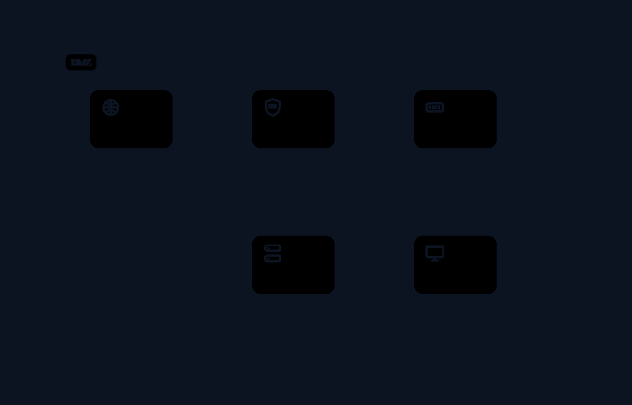

# OTDraw

A zero-dependency, single-file OT/ICS topology diagram editor — map industrial control systems, present attack paths, ingest real configs.



## Features

- **OT/ICS palette** — 14 industrial device types (PLC, RTU, HMI, IED, VFD, motor, sensor, actuator, valve, historian, engineering workstation, jumper, conveyor, safety relay) plus 58 IT/network/threat shapes
- **Core editor** — SVG canvas with pan/zoom, bezier + orthogonal edge routing, connection ports, labeled zones, swimlanes with lane snap, snap-to-grid, undo/redo, marquee select, double-click rename, properties panel
- **Export** — SVG (vector), PNG (2x), animated GIF (hand-rolled LZW encoder, 1.6s seamless loop), PlantUML text
- **Record** — viewport-true video capture via MediaRecorder, optional mic or music-file audio
- **Presentation** — journey builder (steps, narration, object picking) + present mode with camera tweens, cumulative reveals, dimming
- **PlantUML bridge** — import `.puml` (component/deployment subset, packages→zones, stereotypes→OT/ICS shapes) and export back
- **Config ingestion** — parse Cisco-style running-configs into a topology, ingest CMDB JSON/CSV exports with zone grouping; preview-confirm before any canvas mutation

Full feature checklist: [AUDIT.md](AUDIT.md)

## Quick Start

Open `index.html` directly in a browser — double-click it or:

```
start index.html        # Windows
open index.html         # macOS
xdg-open index.html     # Linux
```

Zero console errors, zero network requests. The app is fully offline: no CDN, no web fonts, no telemetry. Autosave to localStorage; `Ctrl+S` exports JSON.

## Usage

| Key | Action |
|---|---|
| `V` | select / move |
| `C` | connect nodes |
| `Z` | draw zone |
| `L` | draw swimlane |
| `H` / `Space` | pan |
| `F` | fit to content |
| `G` | toggle grid snap |
| `Del` / `Backspace` | delete selection |
| `Ctrl+Z` / `Ctrl+Y` | undo / redo |
| `Ctrl+S` | save JSON |
| `Ctrl+D` | duplicate node |
| `J` | journey builder |
| `Esc` | exit present / cancel |

Drag palette shapes onto the canvas. Drag from a node's port to another node to connect. Double-click anything to rename. The **Export** menu (top right) has SVG/PNG/GIF/PlantUML/Record. The **PlantUML** button imports `.puml`; the **Ingest** button takes running-configs or CMDB JSON/CSV.

## Development

```
node test/run-tests.js    # fixture tests: config parsers, CMDB ingest
node test/audit.mjs       # parity audit: zero-network, round-trips, GIF
```

Playwright is a devDependency (audit harness only) — the app itself is a single HTML file with zero dependencies.

## License

MIT